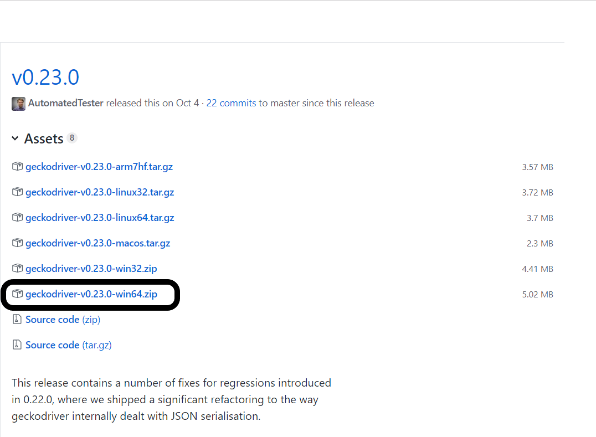
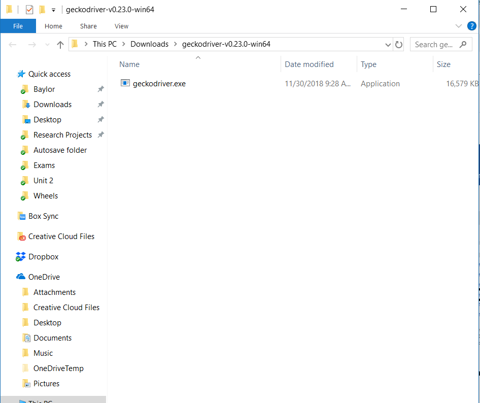
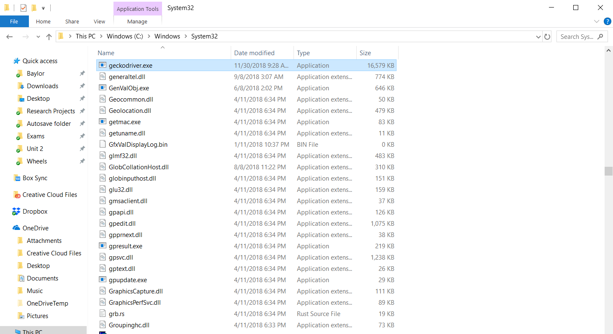
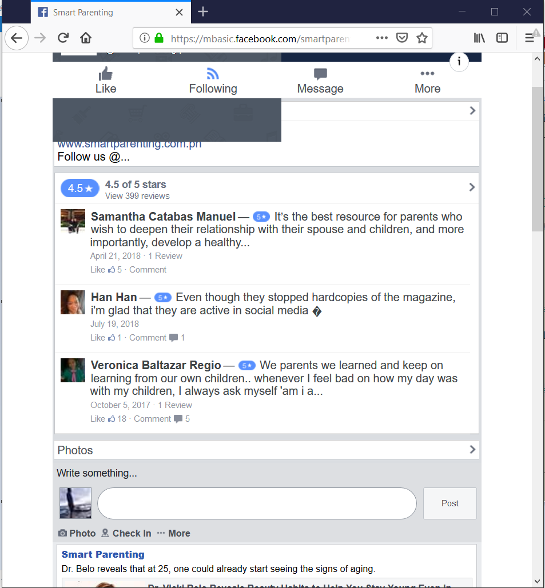
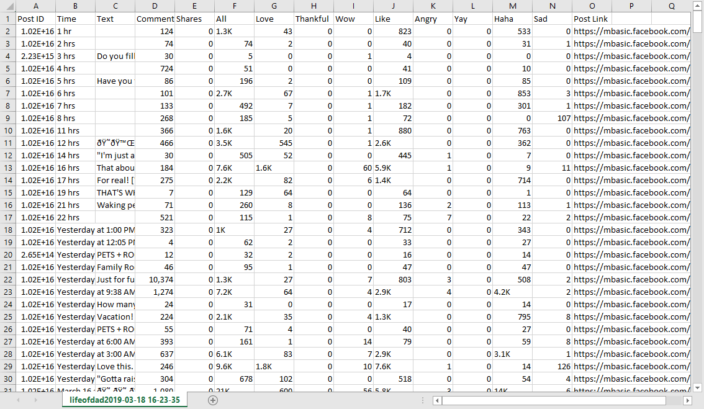
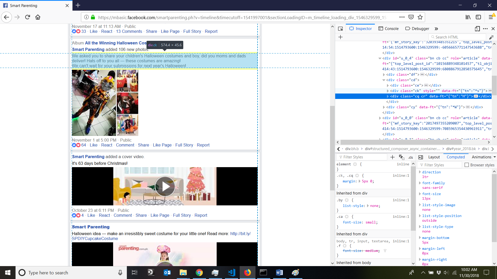

# FacebookScraper
A python scraper using selenium to extract Facebook post data including
* Post ID
* Post Time
* Post Text
* Number of comments, Shares, Emojis (Love, Thankful, Wow, Like, etc)
* Post Link


## Usage

1. Install Python https://www.python.org/downloads/release/python-371/

2. Install a Python IDE (for example: visual studio code) https://code.visualstudio.com/

3. Download Firefox browser (the program requires  Firefox)

4.	Install Package Selenium
(https://selenium-python.readthedocs.io/installation.html).
Using pip, you can install selenium like this: 
    ```
        pip install selenium
    ```

5. Download the Firefox driver according to your system


6. Unzip the file and move it to C:\Windows\System32

    

    

7. Use your IDE to edit the file scraper.py
You need to fill in base_url, account, password. (Only if you log in, you can have full access to someone’s home page.)

8. Run this Python file. It would launch a Firefox brower, log in FaceBook for you and go to the base_url you filled in the previous step.

    When the program runs, it would look like this

    

9. When the program finishes, check the csv file in your current folder.

    ## CSV Sample
    The output file is csv, stored in the same folder as this script.

    

## Important Message
This scraper is only for educational purpose. 

## Note
Sometimes, you may need to change the xpath when you get no posts.
Move your cursor to one post. Right click. Inspect Element.

